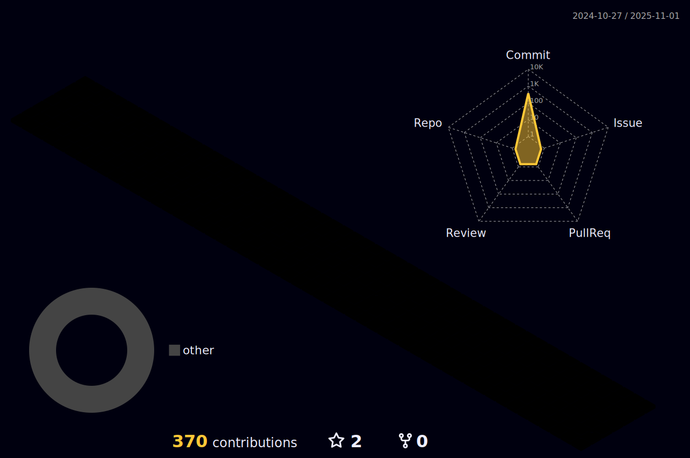

### Hi there 👋

<iframe src="https://chartbase.so/embed/bc8e43c0-e441-4bc0-8bb4-e03de9727702" width="600" height="400" frameborder="0"></iframe>

Language
 
     
 
FrameWork
 

 
DataBase
 

 
DevOps
 

  

  

